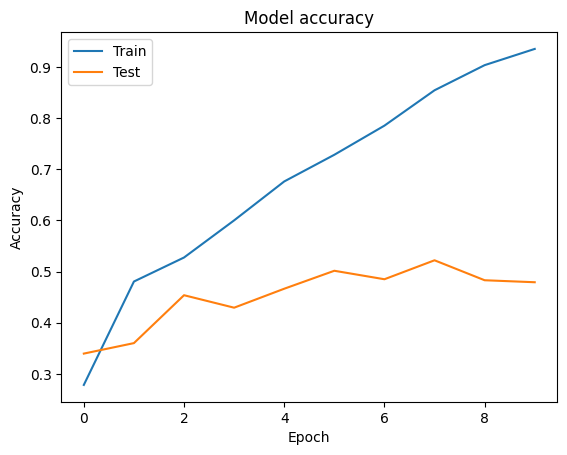
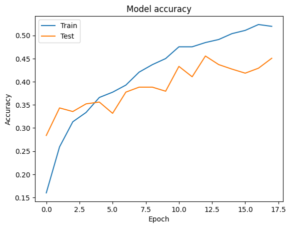

# Fruit Classification Model - First Attempt
**Dataset used:** `https://www.kaggle.com/datasets/karimabdulnabi/fruit-classification10-class`
## Model Attempt 1
- **Model used:** `fruit_classification_model_attempt_1.h5`
- **Results:** 

### Observations:
After training the model, the following was observed:
- **High accuracy on the training set**
- **Low accuracy on the test set**

This indicates **overfitting**, meaning the model has "memorized" the training data rather than learning general patterns that would allow it to perform well on new data.

### Possible Cause:
- The model appears to be **too complex** for the amount of data available.
- It was likely trained for **too many epochs**, causing it to overfit.

### Next Steps:
To address this issue, I will:
- **Data Augmentation**
- **Regularization (L2 or L1)**


## Model Improvement: Data Augmentation

Initially, the model was trained using a simple approach like this:

```python
# Training without data augmentation
history = model.fit(train_images, train_labels, epochs=10, validation_data=(test_images, test_labels))
```

After applying data augmentation
```python
# Training with data augmentation
# data augmentation
from tensorflow.keras.preprocessing.image import ImageDataGenerator

datagen = ImageDataGenerator(
    rotation_range=20,
    width_shift_range=0.2,
    height_shift_range=0.2,
    shear_range=0.2,
    zoom_range=0.2,
    horizontal_flip=True,
    fill_mode='nearest')

datagen.fit(train_images)

reduce_lr = ReduceLROnPlateau(monitor='val_loss', factor=0.2, patience=3, min_lr=0.001)
early_stopping = EarlyStopping(monitor='val_loss', patience=5, restore_best_weights=True)


# training
batch_size = 16
history = model.fit(
    datagen.flow(train_images, train_labels, batch_size=batch_size),  # Generates augmented images
    epochs=50,  # Number of training epochs
    validation_data=(test_images, test_labels),  # Validation data (not augmented)
    steps_per_epoch=len(train_images) // batch_size, # Number of steps per epoch
    callbacks=[reduce_lr, early_stopping]
)
```

## Model Improvement: Regularization (L2 or L1)

```python
# build the neural network
# build the neural network
model = models.Sequential([
    layers.Conv2D(32, (3, 3), activation='relu', input_shape=(100, 100, 3),
                  kernel_regularizer=regularizers.l2(0.001)),
    layers.MaxPooling2D((2, 2)),
    
    layers.Conv2D(64, (3, 3), activation='relu', 
                  kernel_regularizer=regularizers.l2(0.001)),
    layers.MaxPooling2D((2, 2)),
    
    layers.Conv2D(128, (3, 3), activation='relu', 
                  kernel_regularizer=regularizers.l2(0.001)),
    layers.MaxPooling2D((2, 2)),
    
    layers.Flatten(),
    layers.Dense(128, activation='relu', kernel_regularizer=regularizers.l2(0.001)),
    layers.Dropout(0.5),
    layers.Dense(10, activation='softmax')  # 10 classes for 10 fruits
])

model.compile(optimizer=Adam(learning_rate=0.0001),
              loss='sparse_categorical_crossentropy',
              metrics=['accuracy'])
```

## Model Attempt 2
- **Model used:** `fruit_classification_model_attempt_2.h5`
- **Results:** 
